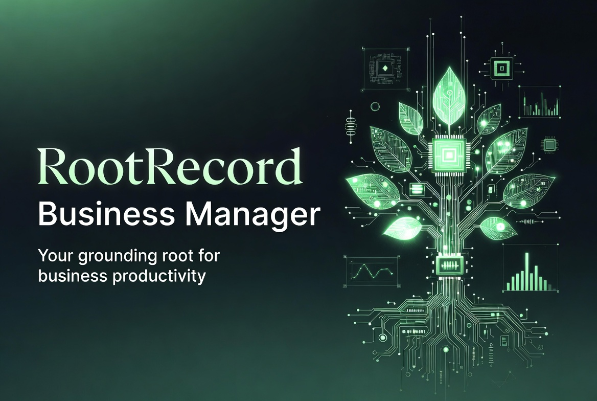
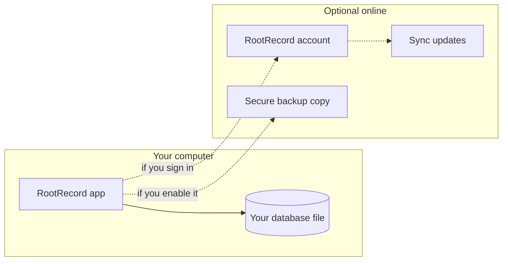
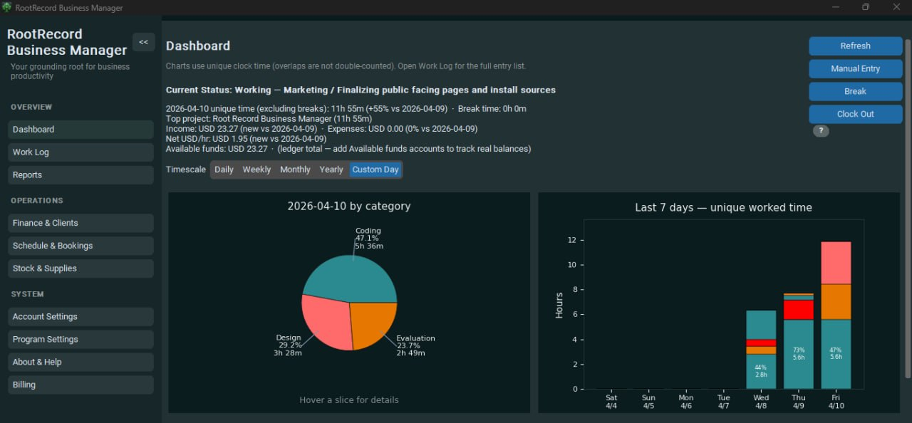

> **RootRecord Business Manager** - product overview, download links, and release notes. The Windows installer is attached to **[GitHub Releases](https://github.com/RootRecord/rootrecord-business-manager-download/releases)** only (not stored in git).

---

# RootRecord Business Manager

**One calm workspace for time, money, clients, inventory, and reports - built for owners and operators who want clarity without living in a browser.**

Current release: **1.3.36** (see **About & Help** in the app for the exact build on your device.)

**[Download the Windows installer (latest release)](https://github.com/RootRecord/rootrecord-business-manager-download/releases/latest)**

[Website](https://rootrecord.info/) | [Terms](https://rootrecord.info/terms) | [Privacy](https://rootrecord.info/privacy) | [Contact](https://rootrecord.info/contact)

---

## Table of contents

1. [Why RootRecord](#why-rootrecord)
2. [Who it is for](#who-it-is-for)
3. [At a glance](#at-a-glance)
4. [How your data works](#how-your-data-works)
5. [Feature tour](#feature-tour)
6. [Account, billing, and optional online services](#account-billing-and-optional-online-services)
7. [Privacy & security](#privacy--security)
8. [System requirements](#system-requirements)
9. [Getting started](#getting-started)
10. [FAQ](#faq)
11. [Support](#support)

---

## Why RootRecord

Running a business means juggling **time on the clock**, **money in and out**, **people you bill**, **things you stock**, and **deadlines you cannot miss**. Most tools split that across tabs, subscriptions, and cloud dashboards you do not control.

**RootRecord Business Manager** brings those workflows into a **single, fast desktop application** that keeps **your operational database on your machine** by default. You get:

- **Honest totals** - for example, overlapping time blocks are merged for summaries so "hours worked" reflects real clock time, not double-counted minutes.
- **Professional outputs** - invoices and reports export to **PDF** and **CSV** using the same business details you maintain in the app.
- **Room to grow** - **multi-business profiles**, and **scheduled / prompted logging** for teams that need structure without enterprise complexity.

This document is written for **customers and evaluators**. Step-by-step field help also lives inside the app under **About & Help -> User guide**.

---

## Who it is for

| Audience | How RootRecord helps |
|----------|----------------------|
| **Freelancers & consultants** | Track billable and non-billable time by category and project; invoice clients; see tax-oriented summaries in one place. |
| **Small service businesses** | Schedule work, manage client records, watch cash flow (income vs expenses), and keep stock or supplies sane as you scale. |
| **Operators wearing many hats** | Dashboard for "today," prompts so logging does not slip, debts and invoices in the same finance hub. |
| **Privacy-minded owners** | Local-first storage: your ledger lives where you install the app unless you turn on optional online features. |

---

## At a glance

| | Capability |
|---|------------|
| **Time** | Clock in / break / clock out, rich categories, projects, timed prompts, bulk repair of entries. |
| **Money** | Income and expenses with currency, descriptions, and business scoping. |
| **Clients** | CRM-style records for billing and scheduling; archive without losing history. |
| **Invoices** | Drafts, line items, tax, PDF export with your letterhead fields. |
| **Debts** | Track balances and close them into posted expenses when settled. |
| **Tax estimator** | Date-window view of income minus expenses for planning (not legal tax advice). |
| **Schedule** | Events with local timezone wall times; link clients and projects. |
| **Stock & supplies** | Products and materials, reorder hints, quick quantity adjustments. |
| **Work log & reports** | Day-true work history, search, charts, exports. |
| **Backups** | Local automatic backups; optional secure online copy of backup files. |

---

## How your data works

Your day-to-day records live in **one local database file** on your computer (the app shows you where in the status area). That design means:

- **You own the file** - back it up like any important document (the app can automate local backups on a schedule).
- **You stay productive offline** - clock time, enter expenses, and draft invoices without waiting on a website.
- **Optional online services are exactly that - optional** - sign-in and subscription features, sync, and secure backup copies are layered on only when you enable or purchase them.

**Sync with Cloud** (when signed in) sends **pending items** from this device to your account and downloads **new items from your other signed-in devices** for supported activity types (for example, work session activity). It is not a substitute for a full database file backup.

**Online backup copy** (optional) saves a **protected full-database snapshot** after local backups complete - separate from sync, ideal for disaster recovery.

---

## Feature tour

### Dashboard

Your **command center for today**: time worked with overlap-aware math, money summaries where configured, and recent activity so you always know what just happened.

---

### Time

- **Categories** separate planning from execution (for example, evaluation vs development) and include sensible defaults for research, marketing, meetings, travel, support, and more.
- **Projects** attach work to the right client or initiative.
- **Clock discipline** - clock in, break, and clock out follow a clear state machine so one block closes before the next begins.
- **Prompts** - optional reminders on an interval you control, with timeout actions for when you are heads-down.
- **Check-in popups** appear when you are actively working - they pause during breaks and when you are clocked out so they respect your flow.
- **Bulk edit** - repair duplicates, shift windows, or retag many entries at once from Work Log workflows.

---

### Finance & Clients

**Money** - Record income and expenses with amount, currency, and rich context. Lists and summaries respect the same fields so reports stay trustworthy.

**Clients** - Names, companies, contact channels, tax IDs, and notes. Save new, load by ID to edit, archive to hide from pickers while preserving data.

**Invoices** - Create drafts, set client and dates, manage tax and notes, edit multiline line items (`description | quantity | unit price`), then export **PDF** using your **Business** details as the "From" block.

**Debts** - Track what you owe or are owed; closing a debt can post the settlement cleanly into expenses.

**Tax Estimator** - For a chosen date range, see **income minus expenses** posted in that window to support planning conversations with your accountant (not a substitute for professional tax advice).

---

### Schedule & Bookings

Schedule **events** with start and optional end in **your business timezone** (or system time when configured that way). Link optional **client** and **project**, track status from scheduled through done or cancelled, and scan the next thirty days from "now."

---

### Stock & Supplies

One surface for **what you sell** and **what you consume**:

- **Products** - SKU, unit, quantity on hand, reorder level, optional cost and price, notes.
- **Supplies & materials** - Categories such as office or production inputs, vendor, units, reorder levels.
- **Apply delta qty** - Add or subtract on-hand without re-saving entire forms.
- **Archive** - Hide rows from active lists while keeping history in the database.

---

### Work Log & Reports

- **Work Log** aligns entries to **local calendar days** converted correctly to UTC internally - the day you see is the day you mean.
- **Reports** search across time, income, and expenses; refresh ranges before exporting.
- **Task and category breakdowns** merge overlaps inside each bucket so totals reflect unique clock coverage.
- **Exports** - **CSV** and **PDF** for sharing with stakeholders or your bookkeeper.

---

### Business profile & settings

Under **Account Settings** and **Program Settings** you control:

- **Business legal and contact fields** that feed invoices and exports.
- **Timezone** - drives schedule parsing and "today" on the dashboard.
- **Multi-business mode** - separate profiles with scoped money totals when you need them.
- **Themes, prompts, auto-backup interval, tray behavior**, and more - tuned for daily desktop use.

---

## Account, billing, and optional online services

- **Sign-in** links this installation to your **RootRecord account** where subscription features are offered.
- **Billing** opens your secure payment flow when you choose to subscribe or manage a plan.
- **Sync with Cloud** (signed in) exchanges supported pending updates and merges remote items - use it after working offline or on a second PC.
- **Online backup copy** (optional) uploads a **full backup file** after each successful **local** backup when enabled - separate from sync, aimed at recovery.

Trial and subscription states may place the app in **read-only** mode until billing is current; the UI explains next steps clearly.

---

## Privacy & security

| Topic | What you should know |
|-------|----------------------|
| **Primary storage** | Your database file stays under your user profile (Windows) or home directory (Linux) unless your organization redirects it. |
| **Exports** | PDF and CSV land where you save them - treat like any sensitive business output. |
| **Sign-in** | Uses industry-standard HTTPS to RootRecord online services; session handling is designed for desktop use. |
| **Secure backup** | Uses a separate long random key stored only on your machine - not your account password. |

For policies governing websites and online services, see **[Privacy](https://rootrecord.info/privacy)** and **[Terms](https://rootrecord.info/terms)**.

---

## System requirements

| | Minimum guidance |
|---|------------------|
| **Operating system** | **Windows 10 or later** (64-bit) is the primary, fully tested experience. A Linux folder bundle may be offered for advanced users; treat Linux as **best-effort** until your organization validates it on target distros. |
| **Display** | 1280×720 or larger recommended; the interface is optimized for modern widescreen laptops. |
| **Disk** | Small install footprint; allow generous free space for database growth, exports, and **local backups**. |
| **Network** | Not required for core local use; required for sign-in, sync, optional secure backup, and external links. |

---

## Getting started

1. **Install** from the **[latest GitHub release](https://github.com/RootRecord/rootrecord-business-manager-download/releases/latest)** (Windows `.exe` installer) or your IT-provided package.
2. **Open Business / Account settings** - set legal name, timezone, and contact fields so invoices and schedules are correct from day one.
3. **Run a local backup** from Program Settings (or wait for the automatic schedule) before a heavy import or migration.
4. **Skim the in-app User guide** under **About & Help** for click-by-click instructions.
5. **Optional** - sign in, enable sync or online backup copy if your workflow needs them.

---

## FAQ

**Why do my "hours worked" totals look lower than a naive sum of rows?**  
Overlapping entries are merged for unique clock coverage so you are not double-counted when two timers straddle the same minutes.

**I edited invoice lines but the PDF looks wrong.**  
Use **Save line items** (and related save actions) in the order shown on screen - the PDF uses the last saved snapshot.

**What happens if my trial ends or payment is past due?**  
The app may switch to **read-only** so you can still view and export while billing is updated. Subscribe or fix payment, then refresh status from **Billing**.

**Is the Tax Estimator my official tax return?**  
No. It is a **planning window** over income and expenses for the dates you pick. Always work with a qualified professional for filing.

**Can I use RootRecord completely offline?**  
Yes for core time, money, clients, inventory, and reports. Sign-in, sync, and secure backup copies need connectivity when you choose to use them.

---

## Support

- **Product website:** [https://rootrecord.info/](https://rootrecord.info/)
- **Contact:** [https://rootrecord.info/contact](https://rootrecord.info/contact)
- **Terms:** [https://rootrecord.info/terms](https://rootrecord.info/terms)
- **Privacy:** [https://rootrecord.info/privacy](https://rootrecord.info/privacy)

For **how-to** detail that mirrors the buttons in the app, open **About & Help -> User guide** inside RootRecord.

---

© RootRecord. All rights reserved.  
*RootRecord Business Manager*  | Release documentation **v1.3.36**

